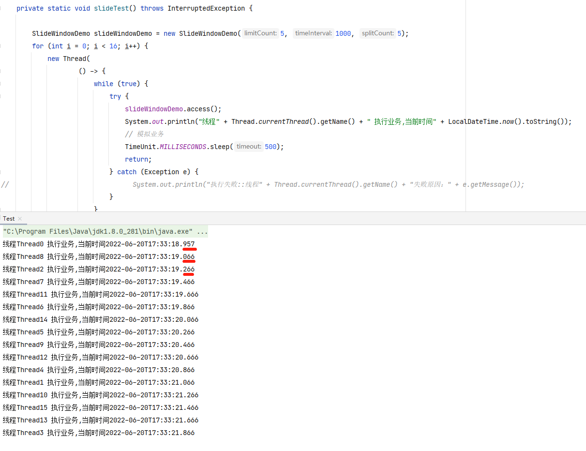

[TOC]
# 常用的四种限流算法

## 一、固定窗口限流
### 1.实现思想
根据固定的时间大小作为一个窗口，对这个窗口进行流量统计
### 2.优缺点
* 优点:实现简单
* 缺点:非规则流量访问时无法精准的进行限流。

我们只统计固定时间范围的访问请求，对于不均匀的访问场景，会出现限流失败的场景。解决方案就是通过多个更细维度的windows，来实现更细维度的限流控制，也就是滑动窗口限流。

### 3.代码示例
我们把整个限流过程分为三部分
1. 限流策略及数据统计
2. window实体,包括窗口的时间大小配置、窗口访问次数
3. 限流判断

#### 3.1 限流策略
首先设置限流策略，规定了具体限流的动作，具体限流判断由子类实现
```java
public abstract class LimitCondition {

    public synchronized boolean isPass(Window window) {
        // 是否通过限流
        boolean isPass = doCheckCondition(window);
        // 通过了 增加通过次数
        if (isPass) {
            window.addCount();
        }
        return isPass;
    }

    // 具体通过限流的逻辑由子类实现
    protected abstract boolean doCheckCondition(Window window);

}
```
具体限流通过的策略：
```java

public class MaxCountLimitCondition extends LimitCondition {

    /**
     * 可访问的最大次数
     */
    private Integer maxCount;

    public MaxCountLimitCondition(Integer maxCount) {
        this.maxCount = maxCount;
    }

    @Override
    protected boolean doCheckCondition(Window window) {
        return window.getSuccessCount() < maxCount;
    }
}
```

#### 3.2 window实体
window主要作用为
1. 规定了当前窗口处理的时间边界（左边界和时间间隔）
2. 当前通过次数统计（由子类实现）。
```java
@Data
public abstract class Window {
    /**
     * 当前窗口统计的时间范围左边界
     */
    private long windowLeft;
    /**
     * 时间间隔(ms)
     */
    private long timeInterval;

    Window(long windowLeft, long timeInterval) {
        this.windowLeft = windowLeft;
        this.timeInterval = timeInterval;
    }

    /**
     * 重置窗口边界
     */
    public void resetWindow() {
        doResetWindow();
    }

    /**
     * 具体重置窗口边界的方法
     */
    protected abstract void doResetWindow();

    /**
     * 获取当前窗口请求数量
     */
    public int getSuccessCount() {
        return doGetSuccessCount();
    }

    /**
     * 具体重置窗口边界的方法
     */
    protected abstract int doGetSuccessCount();

    /**
     * 获取当前窗口请求数量
     */
    public void addCount() {
        doAddCount();
    }

    /**
     * 具体重置窗口边界的方法
     */
    protected abstract void doAddCount();
}
```
具体限流通过计算方法由子类实现
```java

public class FixCountWindow extends Window {

    /**
     * 成功次数
     */
    private AtomicInteger successCount = new AtomicInteger(0);

    public FixCountWindow(long timeInterval) {
        super(System.currentTimeMillis(), timeInterval);
    }

    public FixCountWindow(long leftTime, long timeInterval) {
        super(leftTime, timeInterval);
    }

    @Override
    protected void doResetWindow() {
        super.setWindowLeft(System.currentTimeMillis());
        successCount.set(0);
    }

    @Override
    protected int doGetSuccessCount() {
        return successCount.get();
    }

    @Override
    protected void doAddCount() {
        successCount.incrementAndGet();
    }
}
```
#### 3.3 限流判断
```java

/**
 * 固定窗口限流
 */
public class FixedWindowDemo {

    /**
     * 限流条件
     */
    private final LimitCondition condition;

    /**
     * 窗口实体
     */
    private Window window;

    public FixedWindowDemo(int limitCount, int timeInterval) {
        condition = new MaxCountLimitCondition(limitCount);
        window = new FixCountWindow(timeInterval);
    }

    /**
     * 模拟访问
     */
    public void access() {

        // 不在时间窗口内
        if (!inTimeWindow()) {
            resetWindow();
        }

        // 不可通过限流
        if (!condition.isPass(window)) {
            throw new RuntimeException("不通过限流");
        }

    }

    private boolean inTimeWindow() {
        return System.currentTimeMillis() - window.getWindowLeft() < window.getTimeInterval();
    }

    private void resetWindow() {
        window.resetWindow();
    }
}
```

#### 3.4 运行主类与测试结果
主类：我们同时开启五个线程，然后限流为三个请求，可以看到会有两个线程被限流掉
```java

public class Test {

    public static void main(String[] args) throws InterruptedException {
       fixedTest();
    }

    private static void fixedTest() {
        FixedWindowDemo fixedWindowDemo = new FixedWindowDemo(3, 1000);
        for (int i = 0; i < 5; i++) {
            new Thread(
                    () -> {
                        try {
                            fixedWindowDemo.access();
                            // 模拟业务
                            TimeUnit.MILLISECONDS.sleep(5000);
                        } catch (Exception e) {
                            System.out.println("执行失败::线程" + Thread.currentThread().getName() + "失败原因" + e.getMessage());
                        }
                    }
                    , "Thread" + i)
                    .start();
        }
    }
}
```

运行结果


## 二、滑动窗口限流
### 1.实现思想
对于不规则流量的访问，固定窗口限流有限流不精准的问题。
问题法上的原因有两个
* 1.窗口内流量统计通过累加完成，无法细致的知道窗口中更细时间粒度的流量情况
* 2.流量统计基于固定时间范围，但实际限流时，大部分场景要求根据最近的一个时间范围流量来判断请求是否超标

为了解决问题1，我们可以把一个固定时间窗口拆分成N个子窗口，再对拆分掉的窗口进行流量分析，拆分的越细致，限流越精准。

作好拆分后，我们可以基于时间滚动创建新的子窗口，解决问题2。比如每秒拆分成四个子窗口，时间到达1000-1250毫秒时，丢弃0-250毫秒的子窗口，只统计250-1250这五个子窗口即可。

### 2.代码示例
具体代码结构实现与固定窗口基本一致,公共父类不再重复给出
#### 2.1 限流策略
```java

public class SlideCountLimitCondition extends LimitCondition {

    /**
     * 可访问的最大次数
     */
    private Integer maxCount;

    /**
     * 每个格子的最大访问次数
     */
    private int liteWindowMaxCount;

    public SlideCountLimitCondition(Integer maxCount, int splitCount) {
        this.maxCount = maxCount;
        this.liteWindowMaxCount = maxCount / splitCount;
    }

    @Override
    protected boolean doCheckCondition(Window window) {
        SlideWindow slideWindow = (SlideWindow) window;
        // 需要注意的是，不仅整个窗口需要流量判断，对于每个子窗口，也需要判断是否超请求上限
        return window.getSuccessCount() < maxCount
                && slideWindow.getLiteWindowCount() < liteWindowMaxCount;
    }

}
```
#### 2.2 window实体
```java

public class SlideWindow extends Window {

    private final long liteWindowTimeInterval;
    private final int splitCount;
    private LinkedList<FixCountWindow> windows;

    /**
     * @param windowLeft   windowLeft
     * @param timeInterval 统计的时间周期
     * @param splitCount   分为几个滑动窗口
     */
    public SlideWindow(long windowLeft, long timeInterval, int splitCount) {
        super(windowLeft, timeInterval);
        this.splitCount = splitCount;
        this.liteWindowTimeInterval = timeInterval / splitCount;
        this.windows = new LinkedList<>();
        initWindows(System.currentTimeMillis());
    }

    @Override
    protected void doResetWindow() {
        long currentTimeMillis = System.currentTimeMillis();
        // 计算偏移多少个格子
        long count = (currentTimeMillis - super.getWindowLeft()) / liteWindowTimeInterval;
        // 需要移动多少个格子
        long moveConut = count - splitCount + 1;
        // 滑动数量超过配置大小
        if (moveConut >= splitCount) {
            // 重置
            super.setWindowLeft(currentTimeMillis);
            initWindows(currentTimeMillis);
        } else {
            // 重置固定个数的window
            resetWindows(moveConut);
        }

        super.setWindowLeft(windows.getFirst().getWindowLeft());
    }

    @Override
    protected int doGetSuccessCount() {
        return new Long(
                windows.stream()
                        .map(FixCountWindow::doGetSuccessCount)
                        .reduce(0, Integer::sum)
        ).intValue();
    }

    @Override
    protected void doAddCount() {
        windows.get(
                new Long(
                        (System.currentTimeMillis() - super.getWindowLeft()) / liteWindowTimeInterval)
                        .intValue()
        ).doAddCount();
    }

    public int getLiteWindowCount() {
        return windows.get(
                new Long(
                        (System.currentTimeMillis() - super.getWindowLeft()) / liteWindowTimeInterval)
                        .intValue()
        ).getSuccessCount();
    }

    private void resetWindows(long moveCount) {
        for (int i = 0; i < moveCount; i++) {
            windows.removeFirst();
        }

        int remainSize = windows.size();
        long windowLeft = windows.getFirst().getWindowLeft();

        for (int i = 0; i < moveCount; i++) {
            windows.addLast(
                    new FixCountWindow(
                            windowLeft + (i + remainSize) * liteWindowTimeInterval,
                            liteWindowTimeInterval));
        }
    }

    private void initWindows(long currentTimeMillis) {
        windows = new LinkedList<>();
        windows.add(new FixCountWindow(currentTimeMillis, liteWindowTimeInterval));
        for (int i = 1; i < splitCount; i++) {
            windows.add(
                    new FixCountWindow(
                            currentTimeMillis + i * liteWindowTimeInterval,
                            liteWindowTimeInterval));
        }
    }
}
```
#### 2.3 限流判断
```java

/**
 * 固定窗口限流
 */
public class SlideWindowDemo {
    /**
     * 限流条件
     */
    private final LimitCondition condition;

    /**
     * 窗口实体
     */
    private Window window;

    public SlideWindowDemo(int limitCount, int timeInterval, int splitCount) {
        condition = new SlideCountLimitCondition(limitCount, splitCount);
        window = new SlideWindow(System.currentTimeMillis(), timeInterval, splitCount);
    }

    /**
     * 模拟访问
     */
    public void access() {

        // 不在时间窗口内
        if (!inTimeWindow()) {
            resetWindow();
        }

        // 不可通过限流
        if (!condition.isPass(window)) {
            throw new RuntimeException("不通过限流");
        }

    }

    private boolean inTimeWindow() {
        return System.currentTimeMillis() - window.getWindowLeft() < window.getTimeInterval();
    }

    private synchronized void resetWindow() {
        window.resetWindow();
    }
}

```
#### 2.4 运行主类与测试结果
我们每秒限制请求上限5次，对于1000ms拆分成5个小窗口，那么对于每个小窗口来说，就是每200ms最大可接受1次请求上限
```java
public class Test {

    public static void main(String[] args) throws InterruptedException {
        slideTest();
    }

    private static void slideTest() throws InterruptedException {

        SlideWindowDemo slideWindowDemo = new SlideWindowDemo(5, 1000, 5);
        for (int i = 0; i < 16; i++) {
            new Thread(
                    () -> {
                        while (true) {
                            try {
                                slideWindowDemo.access();
                                System.out.println("线程" + Thread.currentThread().getName() + " 执行业务,当前时间" + LocalDateTime.now().toString());
                                // 模拟业务
                                TimeUnit.MILLISECONDS.sleep(500);
                                return;
                            } catch (Exception e) {
//                                System.out.println("执行失败::线程" + Thread.currentThread().getName() + "失败原因：" + e.getMessage());
                            }
                        }

                    }
                    , "Thread" + i)
                    .start();
        }

        TimeUnit.SECONDS.sleep(60);
    }
}
```
我们每秒限制请求上限5次，对于1000ms拆分成5个小窗口，那么对于每个小窗口来说，就是每200ms最大可接受1次请求上限，可以通过运行结果看到，请求每200ms进行一次


## 三、漏桶限流
### 1.平滑的流量整形
滑动窗口依然无法实现平滑的流量整形。
我们将滑动窗口算法限流设置为qps=30,滑动窗口数设置为5再次运行。


可以看到请求限制到每秒30，对于每个200ms的小窗口来说，最大请求量为6次，但是当流量爆发时，6次请求是同一时刻发出的，转化成曲线可以更直观的看到效果


### 2.实现思想
漏桶算法的思想是控制流量速率。

类比生活中的漏斗，有一个注水口，一个出水口。水通过出水口恒定的流出，通过入水口注入。如果桶没有满就可以接着注水，如果水满了，就无法再放入水了。
* 允许的最大请求数 (capacity)：桶大小
* 流出水时间(duration)： 处理水桶中水需要的时长，在qps语义下为1000
* 我们根据QPS算出来出水速率(v)  = qps / 1000


当桶没有满时，我们可以往其中灌入流量；如果桶满了，我们先看下上次请求时间到现在可以流出的请求数量，再计算一下当前桶容量-流出请求容量是否 > 桶容量。大于则无法继续灌入流量，否则放行。
在流量充沛时，我们设置桶容量为10,漏斗算法的曲线大概如下

### 3.代码示例
```java

/**
 * 漏桶算法
 */
@Data
public class LeakybucketDemo {

    /**
     * @param capacity : 桶容量
     */
    public LeakybucketDemo(long capacity) {
        this.capacity = capacity;
        this.duration = 1000;
        // 根据Qps算通过的效率
        BigDecimal divide = new BigDecimal(capacity).divide(new BigDecimal(duration));
        this.velocity = divide.doubleValue();
    }
    /**
     * The water that is in the bucket.
     */
    private long left;
    /**
     * The timestamp of the last successful water injection.
     */
    private long lastInjectTime = System.currentTimeMillis();
    /**
     * The bucket capacity.
     */
    private long capacity;
    /**
     * The time required for the bucket to be drained.
     */
    private long duration;
    /**
     * The water leakage rate of the bucket, which is equal to capacity/duration.
     */
    private double velocity;

    public boolean tryAcquire() {
        long now = System.currentTimeMillis();
        // Water in the bucket = Previously left water – Water leaked during the past period of time.
        // Water leaked during the last period of time = (Current time – Last water injection time) × Water leakage rate
        // If the current time is too far from the last water injection time (no water has been injected for a long time), the water left in the bucket is 0 (the bucket is drained).
        left = Math.max(0, left - (long)((now - lastInjectTime) * velocity));
        // If no water overflows after one unit volume of water is injected, access is allowed.
        if (left + 1 <= capacity) {
            lastInjectTime = now;
            left++;
            return true;
        } else {
            return false;
        }
    }
}
```
测试类：
```java

public class Test {

    public static void main(String[] args) throws InterruptedException {
        leakyBucketTest();
    }

    private static void leakyBucketTest() {
        LeakybucketDemo leakybucketDemo = new LeakybucketDemo(10);
        ExecutorService service = Executors.newFixedThreadPool(1);

        for (int i = 0; i < 999999999; i++) {
            service.submit(
                    () -> {
                        try {
                            if (leakybucketDemo.tryAcquire()) {
                                System.out.println("线程" + Thread.currentThread().getName() + " 执行业务,当前时间" + LocalDateTime.now().toString());
                                // 模拟业务
//                                TimeUnit.MILLISECONDS.sleep(500);
                            }
                        } catch (Exception e) {
//                                System.out.println("执行失败::线程" + Thread.currentThread().getName() + "失败原因：" + e.getMessage());
                        }
                    }
            );
        }
    }
 }
```
### 4.存在的问题
漏桶算法的流程为：先放入桶大小的流量（capacity）,当请求数大于capacity，则再进行限流。假设桶被填满的时间为t,整体运行时长为T，我们可以用公式表示通过的流量数
    
    capacity + (T - t) * capacity / T

可以看到如果当t足够小时，其与固定窗口算法一样，在固定时间内，可能会承担2capacity的请求数。

我们也可以将QPS和桶容量两个指标来分开，来尽量避免这种问题。
## 四、令牌桶限流
### 1.实现思想
### 2.优缺点
### 3.使用场景
### 4.代码示例


https://zhuanlan.zhihu.com/p/376564740