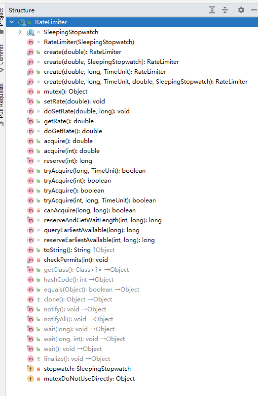
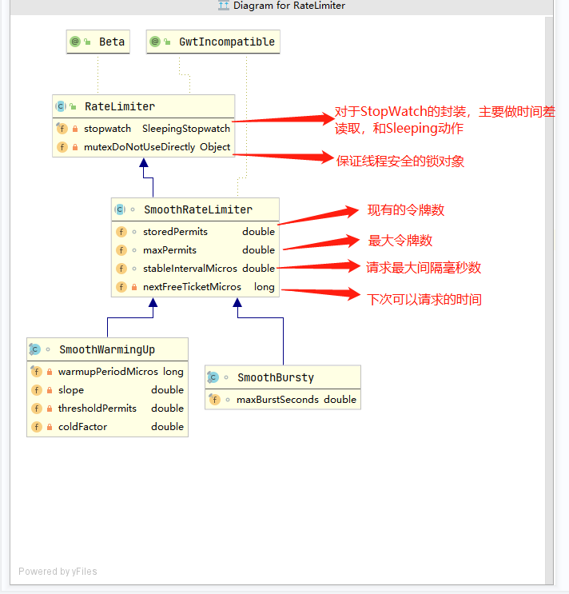

[TOC]

# GuavaRateLimiter限流

## 一、GuavaRateLimiter使用

### 1、maven坐标

```xml
    <dependency>
        <groupId>com.google.guava</groupId>
        <artifactId>guava</artifactId>
        <version>25.1-jre</version>
    </dependency>
```

### 2、限流

```java

public class BaseUse {

    public static void main(String[] args) throws InterruptedException {
        // 限流使用示例
        limit();
    }

    private static void limit() {
        AtomicInteger count = new AtomicInteger(0);
        //新建一个每秒限制10个的令牌桶
        RateLimiter rateLimiter = RateLimiter.create(10.0);
        ExecutorService executor = Executors.newFixedThreadPool(100);
        for (int i = 0; i < 1000000; i++) {
            executor.execute(
                    () -> {
                        //获取令牌桶中一个令牌，最多等待1秒
                        if (rateLimiter.tryAcquire(1, 10, TimeUnit.MINUTES))
                            System.out.println(
                                    Thread.currentThread().getName() +
                                            " " + LocalDateTime.now().toString()
                                            + " " + count.incrementAndGet()
                            );
                    });
        }

        executor.shutdown();
    }
}

```

### 3、预热

```java
public class BaseUse {

    public static void main(String[] args) throws InterruptedException {
 
        // 预热
        warmupLimit();
    }

    private static void warmupLimit() {
        RateLimiter r = RateLimiter.create(10, 5, TimeUnit.SECONDS);
        while (true) {
            r.acquire(1);
            System.out.println("get 1 tokens: " + LocalDateTime.now().toString() + "s");
        }
    }
    
```

## 二、GuavaRateLimiter源码分析
        官方文档：http://docs.guava-libraries.googlecode.com/git/javadoc/com/google/common/util/concurrent/RateLimiter.html
        并发编程网翻译：http://ifeve.com/guava-ratelimiter/

GuavaRateLimiter使用了令牌桶算法，实现了平滑的流量整形。关于限流的基本算法讲解可以点击 [这里](https://note.youdao.com/ynoteshare/index.html?id=2eec5f5df33d02e743eb750e42fa45a3&type=note&_time=1655795577805)

我们先来看下其核心方法


### 1.GuavaRateLimiter核心字段与方法
#### 1.构造方法
GuavaRateLimiter提供了两组Create方法来区分两种不同的限流方式
* 限流：
```java
    /*
    * permitsPerSecond : 每秒最大可通过的许可数量
    */
    public static RateLimiter create(double permitsPerSecond)
```

* 预热

```java
    /*
    * permitsPerSecond : 每秒最大可通过的许可数量
    * warmupPeriod ：预热时长
    * unit : 预热时长的时间单位
    */
    public static RateLimiter create(double permitsPerSecond, long warmupPeriod, TimeUnit unit)
```

两种限流措施通过不同的实现子类实现，我们看一下类图



#### 2.速率修改
GuavaRateLimiter也提供了一组限流速率的获取和修改方法

```java

public final double getRate()：

/*
  * permitsPerSecond : 更新RateLimiter的稳定速率，参数permitsPerSecond 由构造RateLimiter的工厂方法提供。
 */
public final void setRate(double permitsPerSecond)：

```
#### 3. 资源获取
##### 3.1 acquire()方法
和所有并发类框架相同，RateLimiter也提供了acquire方法实际获取资源和tryAcquire方法尝试获取资源

acquire方法提供了两种方式，可以自定义获取令牌数

```java
/*
*  从RateLimiter获取指定许可数，该方法会被阻塞直到获取到请求。
*/
public double acquire(int permits)

/*
* 从RateLimiter获取一个许可，该方法会被阻塞直到获取到请求。此方法等效于acquire（1）。
*/
public double  acquire()
```

官方文档中有这样一句话
    
    RateLimiter经常用于限制对一些物理资源或者逻辑资源的访问速率。

RateLimiter使用了令牌桶算法，所以他重点是为了提供平滑的请求与（访问速率）。同时如果只是对于QPS进行限流，我们默认使用acquire()方法即可.
RateLimiter不仅仅支持对流量的整形，还可以对网络资源、IO等进行固定速率的读取。官方给出了两种场景的使用示例：
举例来说明如何使用RateLimiter，想象下我们需要处理一个任务列表，但我们不希望每秒的任务提交超过两个：

举例来说明如何使用RateLimiter，想象下我们需要处理一个任务列表，但我们不希望每秒的任务提交超过两个：

```java
//速率是每秒两个许可
final RateLimiter rateLimiter = RateLimiter.create(2.0);

void submitTasks(List tasks, Executor executor) {
    for (Runnable task : tasks) {
        rateLimiter.acquire(); // 也许需要等待
        executor.execute(task);
    }
}
```

再举另外一个例子，想象下我们制造了一个数据流，并希望以每秒5kb的速率处理它。可以通过要求每个字节代表一个许可，然后指定每秒5000个许可来完成：

```java
// 每秒5000个许可
final RateLimiter rateLimiter = RateLimiter.create(5000.0); 

void submitPacket(byte[] packet) {
    rateLimiter.acquire(packet.length);
    networkService.send(packet);
}
```


##### 3.2 tryAcquire()方法
其也提供四种tryAcquire()方法来尝试获取资源，返回boolean由适用放自确认获取失败后的逻辑
```java
boolean tryAcquire(int permits, long timeout, TimeUnit unit)：从RateLimiter 获取指定许可数如果该许可数可以在不超过timeout的时间内获取得到的话，或者如果无法在timeout 过期之前获取得到许可数的话，那么立即返回false （无需等待）。

boolean tryAcquire(long timeout, TimeUnit unit)：从RateLimiter 获取许可如果该许可可以在不超过timeout的时间内获取得到的话，或者如果无法在timeout 过期之前获取得到许可的话，那么立即返回false（无需等待）。

boolean tryAcquire(int permits)：如果可以立即获得许可证，则从该限速器处获得许可证。此方法等效于tryAcquire（permits，0，anyUnit）。

boolean tryAcquire()：如果可以立即获得许可证，则从该限速器处获得许可证。等同于tryAcquire(1)。
```

### 2. 限流源码

我们先来简单复习一下令牌桶的基本思想。令牌桶侧重的是对入口流量速率的限制。整体流程分为如下几步
1. 计算当前可放过请求数
   
        当前可放过请求数 = 上次剩余可通过请求数 + (当次请求时间 - 上次请求时间) * 分配速率

2. 判断是否可通过
        
        当前可放过请求数 - 1 > 0 则可通过
  
RateLimiter会初始化一下几个值

* maxPermits ：当前时间周期(秒)可通过的最大请求数
* storedPermits：剩余可使用令牌数量
* neetFreeTicketMicros: 下次允许请求时间
* stableIntervalMicros： 两次请求时间最大间隔

接下来我们开始跟踪初始化的源码,来查看其是如何维护这些数据的。

#### 1.1 初始化

RateLimiter非常简单,只需要一行代码即可。

```java
    RateLimiter rateLimiter = RateLimiter.create(10.0);
```

限流主要用到了SmoothBursty实现类，可以根据类图判断其主要功能是根据SmoothRateLimter中的字段维护的。其用maxPermits和storedPermits维护最最大和现有的permit数量，
还有另外两个字段,stableIntervalMicros表示两次请求最小的时间间隔,neetFreeTicketMicros表示下次请求的时间毫秒数。 可以猜想其判断 ”当前最大可放行请求个数“
是根据计算当前请求时间是否到达了下次请求的时间（neetFreeTicketMicros）来判断的， 这样在短暂无流量后，突然来了一波流量的场景下，比（上次请求时间差 * 设定的分配速率）更能保证流量的平滑性。  

源码阅读：
```java
  /**
   * SleepingStopwatch.createFromSystemTimer() 只是创建了一个SleepingStopWatch,主要跟踪create方法
  */
  public static RateLimiter create(double permitsPerSecond) {
    return create(permitsPerSecond, SleepingStopwatch.createFromSystemTimer());
  }
  
  // 创建一个SleepingStopwatch
   public static SleepingStopwatch createFromSystemTimer() {
      return new SleepingStopwatch() {
        final Stopwatch stopwatch = Stopwatch.createStarted();

        @Override
        protected long readMicros() {
          return stopwatch.elapsed(MICROSECONDS);
        }

        @Override
        protected void sleepMicrosUninterruptibly(long micros) {
          if (micros > 0) {
            Uninterruptibles.sleepUninterruptibly(micros, MICROSECONDS);
          }
        }
      };
    }
    
  @VisibleForTesting
  static RateLimiter create(double permitsPerSecond, SleepingStopwatch stopwatch) {
    RateLimiter rateLimiter = new SmoothBursty(stopwatch, 1.0 /* maxBurstSeconds */);
    rateLimiter.setRate(permitsPerSecond);
    return rateLimiter;
  }
  
```

```java
    SmoothBursty(SleepingStopwatch stopwatch, double maxBurstSeconds) {
      super(stopwatch);
      this.maxBurstSeconds = maxBurstSeconds;
    }
    
    private SmoothRateLimiter(SleepingStopwatch stopwatch) {
        super(stopwatch);
    }
```

首先我们根据一系列的构造方法跟下去，发现只是去初始化了SmoothBursty中的stopwatch以及SmoothRateLimiter中的maxBurstSeconds。
SmoothRateLimiter中的maxBurstSeconds之前没有介绍过，我们可以阅读源码上的注释
   
    如果这个限流器很久没使用了，允许多少秒的的permits，这个参数默认为1。
    The work (permits) of how many seconds can be saved up if this RateLimiter is unused?

再去看rateLimiter.setRate(permitsPerSecond)中的逻辑
```java
 public final void setRate(double permitsPerSecond) {
    // 业务check
    checkArgument(
        permitsPerSecond > 0.0 && !Double.isNaN(permitsPerSecond), "rate must be positive");
    // 懒加载的锁对象
    synchronized (mutex()) {
      //  stopwatch.readMicros() 读取从限流器启动到现在的时间差
      doSetRate(permitsPerSecond, stopwatch.readMicros());
    }
  }
```
```java
 @Override
  final void doSetRate(double permitsPerSecond, long nowMicros) {
    resync(nowMicros);
    // 请求间隔
    double stableIntervalMicros = SECONDS.toMicros(1L) / permitsPerSecond;
    this.stableIntervalMicros = stableIntervalMicros;
    doSetRate(permitsPerSecond, stableIntervalMicros);
  }
```
可以发现主要的代码逻辑在doSetRate中。 
这部分代码执行三个步骤
*  resync(nowMicros),这个方法在限流使用中也会用到,初始化情况中会重置 storedPermits and nextFreeTicketMicro
*  初始化stableIntervalMicros,即根据Qps数算出每次请求间隔的毫秒数
*  doSetRate: 初始化maxPermits和storedPermits

先来看resync(nowMicros) 。这个方法在限流中也会再次用到，初始化逻辑中现根据初始化的实际值去看一下都初始化了什么值就好，具体逻辑会在限流中详细说明

```java
  void resync(long nowMicros) {
    // nowMicros  ：当前距离限流器初始化的时间差
    // nextFreeTicketMicros ： 初始化为0 
    if (nowMicros > nextFreeTicketMicros) {
      // 根据当前时间可通过请求数量
      double newPermits = (nowMicros - nextFreeTicketMicros) / coolDownIntervalMicros();
      // 实际可通过请求数量
      storedPermits = min(maxPermits, storedPermits + newPermits);
      // 更新下次可获取请求时间
      nextFreeTicketMicros = nowMicros;
    }
  }
```
doSetRate：
```java
  @Override
    void doSetRate(double permitsPerSecond, double stableIntervalMicros) {
      double oldMaxPermits = this.maxPermits;
      maxPermits = maxBurstSeconds * permitsPerSecond;
      if (oldMaxPermits == Double.POSITIVE_INFINITY) {
        // if we don't special-case this, we would get storedPermits == NaN, below
        storedPermits = maxPermits;
      } else {
        // 初始化为0
        storedPermits =
            (oldMaxPermits == 0.0)
                ? 0.0 // initial state
                : storedPermits * maxPermits / oldMaxPermits;
      }
    }
```

#### 1.2 限流

```java
public boolean tryAcquire(int permits, long timeout, TimeUnit unit) {
    // 计算超时时间
    long timeoutMicros = max(unit.toMicros(timeout), 0);
    checkPermits(permits);
    long microsToWait;
    synchronized (mutex()) {
      // 算出当次请求距离系统启动的时间差
      long nowMicros = stopwatch.readMicros();
      if (!canAcquire(nowMicros, timeoutMicros)) {
        return false;
      } else {
        // 需要阻塞的时间
        microsToWait = reserveAndGetWaitLength(permits, nowMicros);
      }
    }
    stopwatch.sleepMicrosUninterruptibly(microsToWait);
    return true;
  }
```

```java
 
 final long reserveAndGetWaitLength(int permits, long nowMicros) {
    // 下次可用时间
    long momentAvailable = reserveEarliestAvailable(permits, nowMicros);
    // 可用时间 - 当前时间 = 需要睡眠的时间。
    // <0 说明不需要睡眠, 返回睡眠时间0
    return max(momentAvailable - nowMicros, 0);
 }
```

```java
 @Override
 
  final long reserveEarliestAvailable(int requiredPermits, long nowMicros) {
    // 重置 下次请求可取时间差 和 本周期剩余可取许可数
    resync(nowMicros);
    long returnValue = nextFreeTicketMicros;
    // 使用 掉的 许可次数
    double storedPermitsToSpend = min(requiredPermits, this.storedPermits);
    // 计算最大等待时长。 freshPermits 一定 >= 0
        // 如果请求的许可数 > 可用许可数     storedPermitsToSpend = 可用许可数     freshPermits > 0
        // 如果请求的许可数 < 可用许可数     storedPermitsToSpend = 请求的许可数   freshPermits = 0
    double freshPermits = requiredPermits - storedPermitsToSpend;
    long waitMicros =
        storedPermitsToWaitTime(this.storedPermits, storedPermitsToSpend)
            + (long) (freshPermits * stableIntervalMicros);

    this.nextFreeTicketMicros = LongMath.saturatedAdd(nextFreeTicketMicros, waitMicros);
    // 重算剩余的 许可数
    this.storedPermits -= storedPermitsToSpend;
    return returnValue;
  }
```

```java

  /** Updates {@code storedPermits} and {@code nextFreeTicketMicros} based on the current time. */
  void resync(long nowMicros) {
    // if nextFreeTicket is in the past, resync to now
    // nextFreeTicketMicros 算出来的下一次可用的时间
    // 当前时间 > 原本计算的可用时间, 说明竞争不是那么激烈，在当前周期内，我们可以多放几个请求过来
   
    if (nowMicros > nextFreeTicketMicros) {
    
       // 计算可以多放的请求个数 ：(nowMicros - nextFreeTicketMicros) / coolDownIntervalMicros();
       // (nowMicros - nextFreeTicketMicros) 表示时间差值, 比如当前时间为1000,原计算的请求时间为800。那么我们可以算出200的时间差
       //  coolDownIntervalMicros() : 根据周期请求频次算出每个频次的差距时间。比如qps=5,那么每次请求的间隔时间为200ms
       //  根据以上场景可求得 newPermits = 1; 即本周期我可以多放一个请求过来
      double newPermits = (nowMicros - nextFreeTicketMicros) / coolDownIntervalMicros();
      // storedPermits 为本周期剩余请求, 本周期最大请求 与 newPermits 取min 得到新的本周期可使用请求数
      storedPermits = min(maxPermits, storedPermits + newPermits);
      nextFreeTicketMicros = nowMicros;
    }
  }
```

### 2. 预热

#### 2.1 初始化

#### 2.2 限流