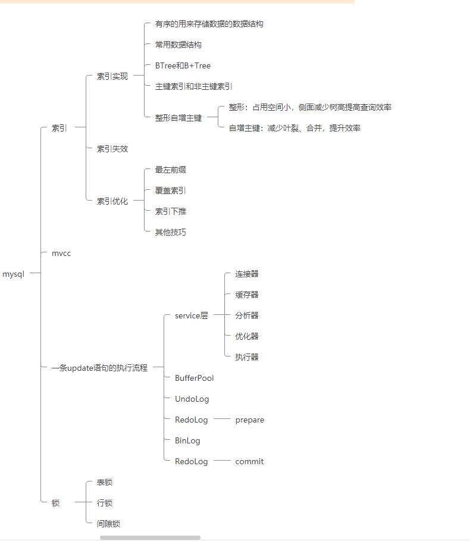
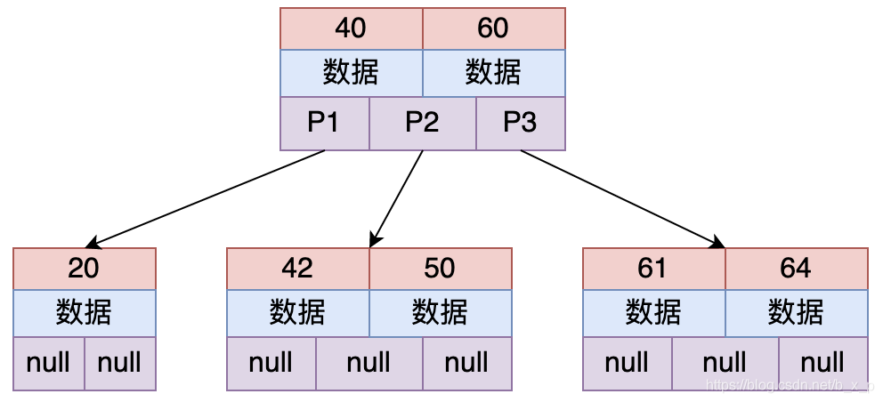

# Mysql



## Mysql的索引

### 索引数据结构选择

    索引是为了加快查找速度的一种有序的数据结构。

既然索引是为了快速查找，我们可以从我们熟悉的数据结构中选择适合快速查找的数据结构来用作索引。

* 哈希表 ：在没有hash冲突的情况下，其查找速率是O(1)

    哈希表的问题：
    
    <p>无法解决范围查询的问题。哈希表是一个数组的链表，我们可以通过快速给数据做Hash找到属于对应数据的桶，并在桶后拉起一个链表用来存储数据。其时间复杂度是O(1)。但是我们查找某个范围数据时
    我们需要对全表数据遍历才可以拿到对应的数据，效率极差。
    </p>
    
    ```sql 
    select * from table where id >10 and id < 200
    ```

* 自平衡二叉搜索树（红黑树） ： 时间复杂度为O(log₂n)
    
    二叉树的问题:
    <p>
    &nbsp;&nbsp;&nbsp;&nbsp;
    无法自平衡，时间复杂最大为0(N)，因此我们会想到自平衡二叉搜索树
    </p>
  <br>
   
    自平衡二叉搜索树的问题：
  
    &nbsp;&nbsp;&nbsp;&nbsp;

    1. 插入数据频繁的做自平衡，效率低
  
    2. 查询效率不稳定

       因为可能在任意叶子结点上，我们可能查询到第一层就返回，也可能查询到最后一层叶子结点才返回，效率不稳定。

    3. 树高过高
       
        数据存储在磁盘上，需要做寻址操作。随机寻址的速度很慢。二叉树只有左右结点，其结点数量为2的N次方-1，如果现在有百万级数据，那么2^20 = 1,048,576
    也就是说，我们要内存寻址20次才可以获取到对应的数据。为了解决这个问题我们可以使用多路树。
    
    4. 没有充分利用磁盘
    
        众所周知，磁盘每次寻址后会一次读取一个最小单位的数据，这个单位叫做数据页。操作系统一般一个数据页大小为4kb，MysqlInnoDb规定一个页为16kb的大小，如果你的数据只有100B，寻址后把其他的数据丢失，是不是也很不划算？


  
```sql
    // mysql 查询数据页大小
    SHOW GLOBAL STATUS like 'Innodb_page_size’;
```


* BTree(Balance Tree) 多路平衡查找树
 

上图为一个2-3树（每个节点存储2个关键字，有3路），多路平衡查找树也就是多叉的意思，从上图中可以看出，每个节点保存的关键字的个数和路数关系为：关键字个数 = 路数 – 1。

假设要从上图中查找id = X的数据，B TREE 搜索过程如下：

     取出根磁盘块，加载40和60两个关键字。
        如果X等于40，则命中；如果X小于40走P1；如果40 < X < 60走P2；如果X = 60，则命中；如果X > 60走P3。
        根据以上规则命中后，接下来加载对应的数据， 数据区中存储的是具体的数据或者是指向数据的指针。

为什么说这种结构能够解决平衡二叉树存在的问题呢？

    B Tree 能够很好的利用操作系统和磁盘的交互特性， MySQL为了很好的利用磁盘的预读能力，将页大小设置为16K，
    即将一个节点（磁盘块）的大小设置为16K，一次IO将一个节点（16K）内容加载进内存。
    这里，假设关键字类型为 int，即4字节，若每个关键字对应的数据区也为4字节，不考虑子节点引用的情况下，则上图中的每个节点大约能够存储（16 * 1000）/ 8 = 2000个关键字，共2001个路数。
    对于二叉树，三层高度，最多可以保存7个关键字，而对于这种有2001路的B树，三层高度能够搜索的关键字个数远远的大于二叉树。

这里顺便说一下：在B Tree保证树的平衡的过程中，每次关键字的变化，都会导致结构发生很大的变化，这个过程是特别浪费时间的，所以创建索引一定要创建合适的索引，而不是把所有的字段都创建索引，创建冗余索引只会在对数据进行新增，删除，修改时增加性能消耗。


* B树确实已经很好的解决了问题.那为什么还要有B+Tree？BTREE和B+TREE区别是什么？


1. B+Tree 根节点和支节点没有数据区，关键字对应的数据只保存在叶子节点中。
   即只有叶子节点中的关键字数据区才会保存真正的数据内容或者是内容的地址。而在B树种，如果根节点命中，则会直接返回数据。

2. B+Tree叶子节点是顺序排列的，并且相邻的节点具有顺序引用的关系。

* 为什么选择B+Tree
1. B+Tree是BTree的优化，BTree能解决的问题B+Tree也可以。
2. 读写能力更强：中间结点不存储数据，只存储索引。在同样的空间大小下，存储的索引更多。增大了查询效率

        举个例子：你在阅读这一本书，这本书规定了只能目录只能占有一页。你想查找第二章第三节的内容，你打开了书的目录，
        BTree的目录就是，展开眼前的先是第一张一节的内容，然后剩下的纸不够了，只能告诉你第一章剩下的内容去第二页看，第五章去100页看，第十章去第300页看
        B+Tree的目录就只有目录，没有内容，清晰的告诉你第一章去第2页，第二章去第十页，第三章去五十页，第四章去75页 第五章去100页……
        然后你打开第十页，B+tree会告诉你 第一节去11页，第二节去15页，第三节去22页……
3. 扫表的能力更强
       
       因为B+Tree子节点中有指针相连，所以扫表能力更强
       举个例子：如果你查询 select * from table where id between 10 and 20; 当前页正好存了10-15的数据
                对于BTree需要重新从根节点读取16的位置，再重新往下寻找
                对于B+tree只需要读取下一个根节点的指针继续扫描即可
       且当扫全表时，B+Tree只需要扫描所有的子节点即可，而BTree需要扫描整个树。


### 索引类型
* 主键索引
   
非叶子结点存储的是主键，叶子结点存储对应的数据
* 非主键索引
    * 单列索引 如 name; 可以列成程特殊的联合索引
    * 联合索引 如 (name,age)
    
非叶子结点存储的是索引，叶子结点存储的数据，数据是主键。如果查询全部数据，需要先回表到主键索引上，再次根据主键查找数据。这个过程叫回表。
### 索引失效

* 索引字段上使用函数
* 隐式转换 - 相当于使用了函数
*  < 、> 会导致后面的字段索引失效
* like = '%' , % 在详细字符前的，会导致索引失效。

### 索引优化
 #### 索引使用原则
 * 经常用的列优先（最左匹配原则） 
 * 离散度高的列优先（离散度高原则）
 * 宽度小的列优先（最少空间原则）

  #### 索引优化原则
  等我再想想

## 事务与MVCC

### 事务的ACID
一个标准的事务需要有ACID四个特性
* A： 原子性
* C：一致性
* I：隔离性
* D：持久性

否则事务可能会出现一系列的问题，脏读，不可重复读，幻读等。
### 事务实现原理
MySQL使用MVCC多版本一致性试图来实现的事务
在事务开启时，每一条事务都会有一个唯一的事务ID。
对于Mysql的每一条数据，都有对应的多个版本，当对数据进行更新时，MYSQL会维护一系列的UndoLog,即回滚段来维护同一条数据的多个版本。
```sql
// 比如
update table set name = "LiJian" where id =1 ;
```
```mermaid
   A
```

当做数据读取时，MySQL会拿到当前获取的所有的事务ID放到一个数组中，数组的最小值作为一个低水位，然后取当前系统中的最大事务作为高水位
那么每个回滚端内的数据会有一下几种可能
* 当前回滚段事务ID小于低水位 ：说明是已提交的事务做出的更改，可见
* 当前回滚段事务ID大于高水位 ：说明是未来的事务做出的更改，不可见
* 如果当前回滚段事务ID在低水位和高水位之间
  * 如果当前回滚段事务在活跃事务数组范围内，说明当前事务还没提交，不可见
  * 如果当前回滚段事务不在活跃事务数组范围内，说明事务在我开启本事务前已提交，可见。


在可重复读RR和读未提交RC两个隔离级别下，会在适当的时候开启一个一致性视图。

RR级别是在begin事务开启后，第一个sql语句开始创建这个视图

RC级别是每一条Sql都会开启一个视图

## SQL语句执行流程

### 执行流程

### BufferPool

### RedoLog

### UndoLog

### BinlLog

## Mysql中的锁

### 表锁

### 行锁

### 间隙锁