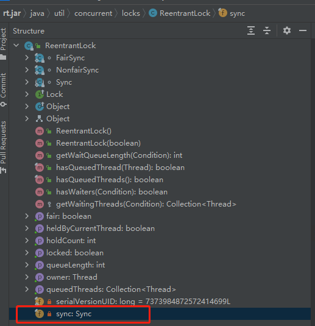
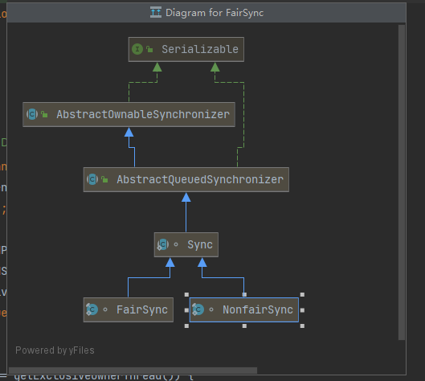
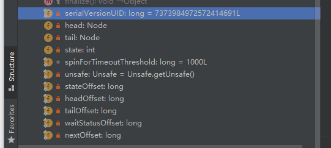
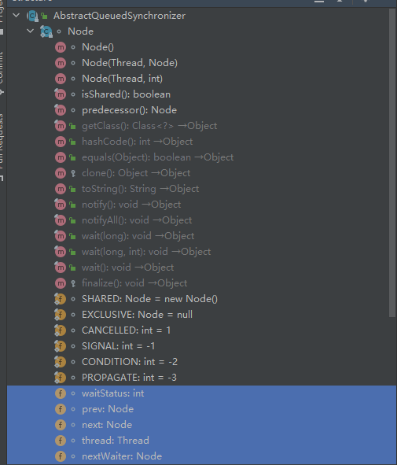
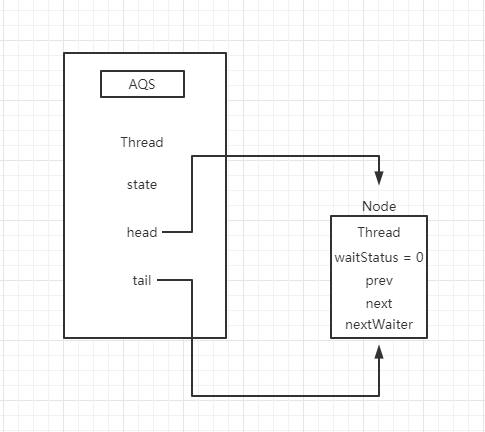
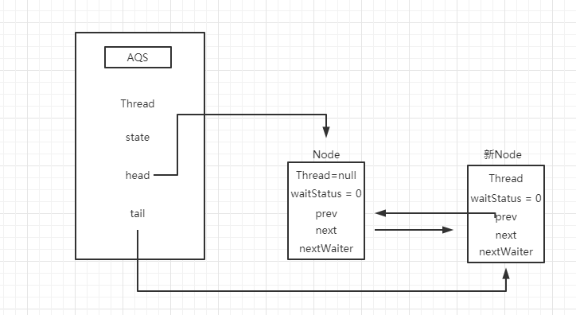
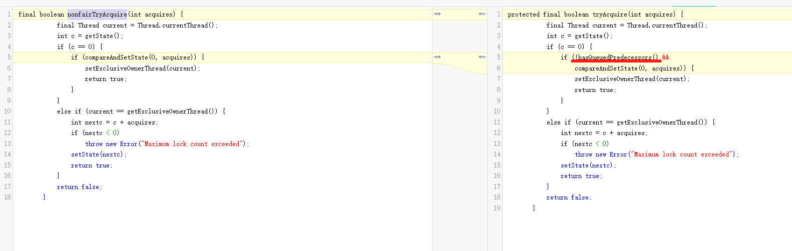
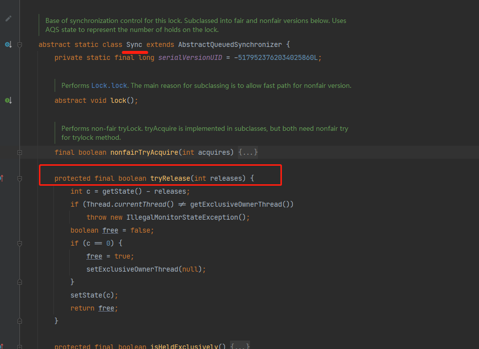
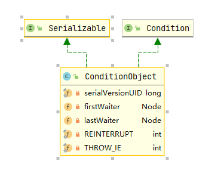

[TOC]

# AQS

## Ⅰ、什么是AQS

AQS是Java中AbstractQueuedSynchronizer的缩写，翻译过来是就是抽象的同步队列，其doc注释第一句话便介绍了什么是AQS，摘录如下
> Provides a framework for implementing blocking locks and related synchronizers (semaphores， events， etc) that rely on first-in-first-out (FIFO) wait queues.

翻译过来就是
> 提供一个框架，用于实现依赖先进先出（FIFO）等待队列的阻塞锁和相关同步器（信号量、事件等）。

个人理解就是当线程发生资源竞争时，控制谁应该获取资源、如何获取资源、如果获取不到应阻塞，那么阻塞在哪里，阻塞后何时唤醒线程的一套框架封装。

## Ⅱ、从ReentranLock看AQS实现

我们最常见的、也是最简单AQS实现便是ReentranLock了，下面通过ReentranLock的实现来感受一下AQS做了什么事情。

### 一、ReentranLock的使用

ReentranLock很简单，如下就是一个最简单的使用demo，

1. 创建实例
2. 锁操作
3. 解锁

```java
   public void useReentrantLockDemo(){
        // 创建锁实例
        ReentrantLock lock = new ReentrantLock();
        // 做锁操作
        lock.lock();
        
        try{
            // 业务代码
            doSomeThing();
        }finally {
            // 解锁操作
            lock.unlock();
        }
    }
```

接下来我们一步步来看ReentranLock如何实现锁操作的

### 二、ReentranLock的实现

#### 2.1.ReentranLock的构造方法

首先我们看一下ReentrantLock的构造方法

  ```java

    /**
    * Creates an instance of {@code ReentrantLock}.   创建ReentrantLock实例
     * This is equivalent to using {@code ReentrantLock(false)}.  此构造方法和new ReentrantLock(false)等价
    */
    public ReentrantLock() {
        sync = new NonfairSync();
    }

    /**
     * Creates an instance of {@code ReentrantLock} with the given fairness policy.
     * 根据是否公平策略创建ReentrantLock实例 
     * @param fair {@code true} if this lock should use a fair ordering policy
     */
    public ReentrantLock(boolean fair) {
        sync = fair ? new FairSync() : new NonfairSync();
    }
   ```

再看下ReentrantLock的核心字段



可以发现ReentrantLock只有一个核心字段sync，从构造方法中我们可以得知，我们有两种策略可以选择:公平与非公平.两者区别只是创建了不同的对象，引用到当前的sync字段.
因此我们查看FairSync、与NonfairSync类图可知，两者均继承了ReentrantLock中的内部抽象类Sync，而Sync实现了AQS。



到此把关系图存在心里留下印象，下面我们来看 锁操作

#### 2.2. ReentranLock的锁操作

之前说AQS就是一个抽象的*队列*， 当线程发生资源竞争时，控制*谁获取资源*， 如果获取不到应*阻塞*， 阻塞后*何时唤醒线程*的一套框架封装。

基于锁的语义，我们可以猜测一下锁的实现流程。

首先我们设定一个既定锁标记，当线程获取锁的时候，我们修改锁标记，并将锁的获取者标记为自己。 如果另一个线程来竞争锁的时候，它发现锁已经被人获取了，那么我们需要排队(入队列)。 如果获取锁的线程如果放弃了锁资源，那么排队的线程应该继续去抢锁。
如果排队的线程一直占用cpu资源等待，是不是也不是很合适。所以我们要阻塞线程资源。

AQS就是一套机制的一个实现 我们来看下AQS中几个核心字段


比较重要的是如下几个字段

```java
    /**
     * 队列头结点
     */
    private transient volatile Node head;

    /**
     * 队列尾结点
     */
    private transient volatile Node tail;

    /**
     * The synchronization state.
     */
    private volatile int state;
```

以及父类中的

```java

    /**
     * 共享模式中获取资源的线程
     */
    private transient Thread exclusiveOwnerThread;
```

首先AQS用state字段标记了锁状态、并实现了一个双端队列去存储应该排队的线程，head、tail分别为队列的头结点和尾结点，并用exclusiveOwnerThread字段存储当前获取锁的线程是谁。我们了解了这些之后，再去看ReentrantLock是如何获取锁的

锁操作是通过lock方法实现的，lock方法引用了sync的lock方法，以下先只看FairSync即公平锁的实现

```java
    /**
     *  获取锁
     *  Acquires the lock.
  
     * 如果没有其他线程hold资源，则立刻获取锁，并把（lock hold count）修改为1
     * <p>Acquires the lock if it is not held by another thread and returns
     * immediately， setting the lock hold count to one.
    
     * （重入）如果当前线程已经获取锁，将hold count递增1，并立刻返回
     * <p>If the current thread already holds the lock then the hold
     * count is incremented by one and the method returns immediately.
     
     * 如果已经被别的资源占有锁，会将当前线程让出调度时间并置于休眠状态，直到（当前线程）可以再次将hold count设置为1
     * <p>If the lock is held by another thread then the
     * current thread becomes disabled for thread scheduling
     * purposes and lies dormant until the lock has been acquired，
     * at which time the lock hold count is set to one.
     */
    public void lock() {
        sync.lock();
    }
```

公平锁中lock实现

```java
 final void lock() {
    acquire(1);
 }
```

acquire为AQS方法

```java

    /**
     * 独占模式的获取，忽略interrupts
     * Acquires in exclusive mode， ignoring interrupts.
     * 
     * 通过至少一次tryAcquire的调用实现（注意此方法是AQS的protected方法，需要子类自己实现，默认会抛异常）， 成功时直接返回
     * Implemented by invoking at least once {@link #tryAcquire}，returning on success. 
     * 
     * 如果失败，线程会入队列，可能会多次阻塞和唤醒，再次执行tryAcquire直到成功
     * Otherwise the thread is queued， possibly repeatedly blocking and unblocking， invoking {@link #tryAcquire} until success.  
     * 
     * 该方法可用来实现锁中的锁操作
     * This method can be used to implement method {@link Lock#lock}.
     *
     * @param arg the acquire argument.  This value is conveyed to
     *        {@link #tryAcquire} but is otherwise uninterpreted and
     *        can represent anything you like.
     */
    public final void acquire(int arg) {
        if (!tryAcquire(arg) &&
            acquireQueued(addWaiter(Node.EXCLUSIVE)， arg))
            selfInterrupt();
    }
```

这个方法可以拆分成四个部分去看

1. 获取资源 - tryAcquire(arg)
2. 初始化队列结点 - addWaiter(Node.EXCLUSIVE)
3. acquireQueued - 阻塞当前线程
4. selfInterrupt(); - 给当前线程中断标记

##### 2.2.1 tryAcquire - 获取锁

此方法由AQS子类自己实现，我们先只关注公平锁的实现，即如果当前锁没有被获取(state == 0)
那就去查看当前队列中没有其他排队的元素了，如果没有，就尝试获取占用资源，获取资源成功，就将当前获取锁的线程标记为自己

```java

    /**
     * Fair version of tryAcquire. 
     * 不直接获取资源，除非队列中没有等待者，或者当前位于队列第一个
     * Don't grant access unless recursive call or no waiters or is first.
     */
    protected final boolean tryAcquire(int acquires) {
        // 获取当前线程
        final Thread current = Thread.currentThread();
        // 获取state;
        int c = getState();
        // AQS state == 0 则可以获取资源
        if (c == 0) {
            // 队列中是否有其他元素，公平锁之所以公平就是先检查了队列中是否有其他等待的线程，
            // 如果没有采取尝试获取锁，否则就直接在此方法返回false，即入队列排队
            if (!hasQueuedPredecessors() 
                 &&
                // 如果队列中没有等待的线程了，尝试获取锁
                // 获取锁就是通过CAS将state修改为acquires 即1
                // 因为AQS没有在构造方法中给state设置初始值，所以默认就是0，此处CAS原值传入0
                compareAndSetState(0， acquires)) {
                // 获取锁成功，将当前拥有锁的线程标记为自己
                setExclusiveOwnerThread(current);
                return true;
            }
        }
        // 处理重入，因为当前线程已经获取到锁了，下面代码不用考虑线程问题.只有当前线程可以走到如下方法.
        else if (current == getExclusiveOwnerThread()) {
            // 将当前state + acquires 因为ReentranLock锁操作acquires=1 所以就是将当前tate+1
            int nextc = c + acquires;
            if (nextc < 0)
                throw new Error("Maximum lock count exceeded");
            // 赋回state
            setState(nextc);
            return true;
        }
        return false;
    }
```

##### 2.2.2 addWaiter(Node.EXCLUSIVE) - 入队列

如果没有获取到资源就执行acquireQueued(addWaiter(Node.EXCLUSIVE)， arg)方法，在执行acquireQueued之前先要执行addWaiter(Node.EXCLUSIVE)
根据方法名可知，方法执行逻辑就是新增一个独占模式(Node.EXCLUSIVE)的waiter

AQS队列由Node维护，我们先来看下Node结点的核心字段。



比较核心的字段为选中标注蓝色的部分

```java

        /**
         * 此字段默认值为0,可以理解0表示当前正在运行中,未被阻塞。还有其他几种可能的状态
             CANCELLED =  1; 已取消
             SIGNAL    = -1  可以理解为当前结点可以被唤醒
             CONDITION = -2  条件队列中使用
             PROPAGATE = -3  非独占模式中使用,需要继续传播,唤醒后续结点获取资源
         * 
         * Status field, taking on only the values:
         *   SIGNAL:     
         *               标记后续的结点被阻塞(或者即将被阻塞),当所以当前取消或者释放资源时,结点要去唤醒后续结点。
         *               The successor of this node is (or will soon be) blocked (via park), so the current node must unpark its successor when it releases or cancels. 
         *              
         *               避免资源竞争,获取资源的方法必须首先拿到这个信号,在去atomic的获取资源,如果失败,阻塞。
         *               To avoid races, acquire methods must first indicate they need a signal,then retry the atomic acquire, and then, on failure, block.
         *               
         *               结点中断或者超时取消,这是结点的一个终态,取消的线程不会再被唤醒了
         *   CANCELLED:  This node is cancelled due to timeout or interrupt. Nodes never leave this state. In particular,a thread with cancelled node never again blocks.
         *   
         *               当前结点在condition队列中,在转换之前不会当做同步队列使用。在特定的时间,会被赋值为0
         *   CONDITION:  This node is currently on a condition queue.It will not be used as a sync queue node until transferred, at which time the status will be set to 0.
         *               ( Use of this value here has nothing to do with the other uses of the field, but simplifies mechanics.)
         *   
         *               共享模式的资源释放应该传递通知其他结点，这个状态只给头结点用。作用是共享模式下释放方法（doReleaseShared）去传递通知给其他结点。
         *   PROPAGATE:  A releaseShared should be propagated to other nodes. This is set (for head node only) in doReleaseShared to ensure propagation continues, 
         *               even if other operations have since intervened.
         *               
         *   0:          None of the above
         *
         * The values are arranged numerically to simplify use.Non-negative values mean that a node doesn't need to signal. So, most code doesn't need to check for particular values, just for sign.
         *
         * The field is initialized to 0 for normal sync nodes, and CONDITION for condition nodes.  It is modified using CAS (or when possible, unconditional volatile writes).
         */
        volatile int waitStatus;

        /**
         * 前驱结点
         * 
         * Link to predecessor node that current node/thread relies on for checking waitStatus. Assigned during enqueuing, and nulled out (for sake of GC) only upon dequeuing.  
         * Also, upon cancellation of a predecessor, we short-circuit while finding a non-cancelled one, which will always exist because the head node is never cancelled: 
         * A node becomes head only as a result of successful acquire. A cancelled thread never succeeds in acquiring, and a thread only cancels itself, not any other node.
         */
        volatile Node prev;

        /**
         * 后驱结点
         * 
         * Link to the successor node that the current node/thread unparks upon release. Assigned during enqueuing, adjusted when bypassing cancelled predecessors,
         * and nulled out (for sake of GC) when dequeued. 
         * The enq operation does not assign next field of a predecessor until after attachment,so seeing a null next field does not necessarily mean that node is at end of queue. 
         * However, if a next field appearsto be null, we can scan prev's from the tail to double-check.  The next field of cancelled nodes is set to point to the node itself instead of null,
         * to make life easier for isOnSyncQueue.
         */
        volatile Node next;

        /**
         * 当前线程
         * The thread that enqueued this node.  Initialized on construction and nulled out after use.
         */
        volatile Thread thread;

        /**
         * condition结点/共享模式的特殊结点
         * Link to next node waiting on condition, or the special value SHARED. 
         * Because condition queues are accessed only when holding in exclusive mode,we just need a simple linked queue to hold nodes while they are waiting onconditions. 
         * They are then transferred to the queue to re-acquire. And because conditions can only be exclusive, we save a field by using special value to indicate shared mode.
         */
        Node nextWaiter;
```

知道了Node的结构后，我们再来看入队列的逻辑

```java

    /**
     * 根据给定的模式，给当前线程创建队列元素
     * Creates and enqueues node for current thread and given mode.
     *
     * @param mode Node.EXCLUSIVE for exclusive， Node.SHARED for shared
     * @return the new node
     */
    private Node addWaiter(Node mode) {
        // 新创建一个Node结点
        Node node = new Node(Thread.currentThread()， mode);
        
        // Try the fast path of enq; backup to full enq on failure
        Node pred = tail;
        if (pred != null) {
            node.prev = pred;
            if (compareAndSetTail(pred， node)) {
                pred.next = node;
                return node;
            }
        }
        // 初始化与尾端插入
        enq(node);
        return node;
    }
```

enq:

```java

    /**
     * Inserts node into queue， initializing if necessary. See picture above.
     * @param node the node to insert
     * @return node's predecessor
     */
    private Node enq(final Node node) {
        for (;;) {
            Node t = tail;
            if (t == null) { // Must initialize
                if (compareAndSetHead(new Node()))
                    tail = head;
            } else {
                node.prev = t;
                if (compareAndSetTail(t， node)) {
                    t.next = node;
                    return t;
                }
            }
        }
    }
```

上面两段代码可以合并重写一下方便理解。（只是为了方便理解流程。改写后的代码可能有线程问题。）

```java
      private Node addWaiter(Node mode) {
        // 新创建一个Node结点
        Node node = new Node(Thread.currentThread()， mode);
        
        // 初始化队列
        // 实例化AQS时，并没有实例化tail和head元素，所以整个队列是懒加载的.第一次tail为null
        if (tail == null) { // Must initialize
            if (compareAndSetHead(new Node()))
            tail = head;
        }
        
       
        // CAS自旋放入队列
        for(;;){
            Node t = tail;
            node.prev = t;
            if (compareAndSetTail(t， node)) {
               t.next = node;
               return t;
            }
        }
        
      }
```

从改写后的代码可以清晰的读到，代码只是简单的将新增结点放入队列中。流程为：新建结点，如果队列没有初始化则初始化队列，然后将新建的结点放入队列中。 我们可以通过图解的方式来清晰的看到队列的情况。 首先，当队列中无元素时，执行初始化



然后新增一个结点，从尾端插入。新增结点的线程为当前线程，nextWaiter为独占模式，即为null。



##### 2.2.3  acquireQueued - 阻塞当前线程

此时主要有三个动作

* 确认自己是否为队头，并再次获取锁.
* 修改前驱结点ws为-1
* 将当前线程阻塞

源码如下

```java
 /**
     * 
     * 独占模式不处理中断的队列唤醒
     * Acquires in exclusive uninterruptible mode for thread already inqueue.
 
     * 条件队列等待方法也会用到这里
     * Used by condition wait methods as well as acquire.
     *
     * @param node the node
     * @param arg the acquire argument
     * @return {@code true} if interrupted while waiting
     */
    final boolean acquireQueued(final Node node, int arg) {
        boolean failed = true;
        try {
            boolean interrupted = false;
            // 自旋
            for (;;) {
                // 获取当前几点的前置结点
                final Node p = node.predecessor();
                // 如果前置结点为队首，就再次尝试获取锁。如果获取成功，将当前结点出列并重置head结点
                if (p == head && tryAcquire(arg)) {
                    // 重置head结点。因为CLH队列会在队首维护一个内容为null的结点。
                    // 此处就是把当前结点初始化为内容为null ，并将head指向当前结点
                    setHead(node);
                    p.next = null; // help GC
                    failed = false;
                    return interrupted;
                }
                // 如果不是队首，那么调用shouldParkAfterFailedAcquire 将前置结点waitStatus修改为-1 即标记当前结点已被阻塞
                // 调用parkAndCheckInterrupt()方法park线程
                // 线程被唤醒时，会继续从调用parkAndCheckInterrupt中的park继续执行
                // 唤醒线程有两种情况 一种是中断唤醒，一种是出队唤醒
                // 中断唤醒需要Api层处理中断策略方法自己去处理中断业务，所以此处只是打了标记。
                if (shouldParkAfterFailedAcquire(p, node) &&
                    parkAndCheckInterrupt())
                    interrupted = true;
            }
        } finally {
            if (failed)
                // 异常需要将当前结点出队
                cancelAcquire(node);
        }
    }
```

###### 2.2.3.1 确认自己是否为队头，并再次获取锁

因为初始化时，CLH队列会维护一个空内容结点，且入队使用尾插法。所以如果当前队列只有一个业务元素的话，当前的prev的指针与head指针指向同样的位置。
如果当前是第一个业务元素的话，会再次尝试获取锁。此时如果获取到锁了，就出队列。否则就修改前驱结点状态为-1,并阻塞当前结点。

```java

    final boolean acquireQueued(final Node node, int arg) {
        boolean failed = true;
        try {
            boolean interrupted = false;
            // 自旋
            for (;;) {
                // 获取当前几点的前置结点
                final Node p = node.predecessor();
                // 如果前置结点为队首，就再次尝试获取锁。如果获取成功，将当前结点出列并重置head结点
                if (p == head && tryAcquire(arg)) {
                    // 重置head结点。因为CLH队列会在队首维护一个内容为null的结点。
                    // 此处就是把当前结点初始化为内容为null ，并将head指向当前结点
                    setHead(node);
                    p.next = null; // help GC
                    failed = false;
                    return interrupted;
                }
               
                 ……
            }
        } finally {
                ……
        }
    }
```

###### 2.2.3.3 修改前驱结点ws为-1

```java
    final boolean acquireQueued(final Node node, int arg) {
        boolean failed = true;
        try {
            boolean interrupted = false;
            // 自旋
            for (;;) {
                ……
                // check是否为队列头并重试获取锁
                ……
                
                // 修改node（前直结点）ws值
                if (shouldParkAfterFailedAcquire(p, node)
                
                 && parkAndCheckInterrupt())
                    interrupted = true;
            }
        } finally {
           ……
        }
    }
```

shouldParkAfterFailedAcquire(p, node)方法负责修改前驱结点状态，源码如下：

```java

    /**
     * Checks and updates status for a node that failed to acquire.
     * Returns true if thread should block. This is the main signal
     * control in all acquire loops.  Requires that pred == node.prev.
     *
     * @param pred node's predecessor holding status
     * @param node the node
     * @return {@code true} if thread should block
     */
    private static boolean shouldParkAfterFailedAcquire(Node pred, Node node) {
        int ws = pred.waitStatus;
        if (ws == Node.SIGNAL)
            /*
             * This node has already set status asking a release
             * to signal it, so it can safely park.
             */
            return true;
        if (ws > 0) {
            /*
             * Predecessor was cancelled. Skip over predecessors and
             * indicate retry.
             */
            do {
                node.prev = pred = pred.prev;
            } while (pred.waitStatus > 0);
            pred.next = node;
        } else {
            /*
             * waitStatus must be 0 or PROPAGATE.  Indicate that we
             * need a signal, but don't park yet.  Caller will need to
             * retry to make sure it cannot acquire before parking.
             */
            compareAndSetWaitStatus(pred, ws, Node.SIGNAL);
        }
        return false;
    }
```

这个部分代码也很好理解，主要分为三个部分

* ws == Node.SIGNAL,返回true,即继续做阻塞动作
* ws > 0 说明有取消的结点，执行取消结点的删除逻辑
* 走到这里说明 ws == 0 || ws == -2 也就是0或者广播模式，这时我们将ws修改为-1

除了一个部分都会返回false，返回到acquireQueued(final Node node, int arg)方法上，acquireQueued方法中有自旋的for循环，因此会再次进入。
也就是说对一个新结点来说，第一次循环将前置结点的ws修改为了-1，第二次才会执行阻塞动作。

###### 2.2.3.2 将当前线程阻塞

接下来就是负责阻塞的代码parkAndCheckInterrupt()了

parkAndCheckInterrupt()如果返回true，说明当前线程由中断唤醒。将中断标记赋为true，返回中断标记，由外部处理中断业务。

parkAndCheckInterrupt()涉及了一些中断的细节，我们来简单看一下，

> 关于中断的基础知识详见：https://blog.csdn.net/b_x_p/article/details/103333240?spm=1001.2014.3001.5502
>
> AQS为什么调用selfInterrupt ： https://www.zhihu.com/question/399039232

```java

    /**
     * 实现中断然后检查是否有中断标记
     * Convenience method to park and then check if interrupted
     *
     * @return {@code true} if interrupted
     */
    private final boolean parkAndCheckInterrupt() {
        LockSupport.park(this);
        return Thread.interrupted();
    }


    /**
     * 检查当前线程是否已经被中断了
     * Tests whether the current thread has been interrupted. 
     * 
     * 中断标记会被清除
     * The <i>interrupted status</i> of the thread is cleared by this method.
     * 
     * 换句话说，如果这个方法被调用两次，第二次会返回false
     * Inother words, if this method were to be called twice in succession, the second call would return false 
     * 除非被再次中断  当前线程再第一次调用后已经清除了他的中断标记，第二调用前又重新标记上了
     * (unless the current thread were interrupted again, after the first call had cleared its interrupted status and before the second call had examined it).
     *
     * <p>A thread interruption ignored because a thread was not alive
     * at the time of the interrupt will be reflected by this method
     * returning false.
     *
     * @return  <code>true</code> if the current thread has been interrupted;
     *          <code>false</code> otherwise.
     *          
     * @see #isInterrupted()
     * @revised 6.0
     */
    public static boolean interrupted() {
            return currentThread().isInterrupted(true);
    }
```

LockSupport.park(this);方法如果线程被中断了，是不会再次阻塞的。因此当前线程会一直去尝试获取锁，这会导致两个问题 1.如果是公平锁，当前线程没有被中断而仍然抢锁，抢到锁了会破坏公平性
2.如果一直没有获取到锁，会占用cpu时间一直空转。 因此我们要清除中断标记和，忽略本次中断。但是会在acquireQueued（）方法中记录中断标记，并通知外部。

##### 2.2.4. selfInterrupt(); - 给当前线程中断标记

那我们再看一下doAcquireShared()外部就很好了解了

```java
 public final void acquire(long arg) {
        if (!tryAcquire(arg) &&
            // 如果中断唤醒,这里会返回true
            acquireQueued(addWaiter(Node.EXCLUSIVE), arg))
            // 走到这里说明线程获取到了锁资源,但是是由中断唤醒的。
            // 重新标记中断标记
            selfInterrupt();
    }
```

其实就很简单了，将当前线程终端标记重置为中断，我们就可以在业务代码中判断是否线程由中断触发，做自己的业务了

#### 2.3. ReentranLock的解锁操作

ReentranLock通过unlock方法做解锁操作，其直接调用了Sync中的release方法，即AQS的APi方法release

```java

    /**
     * Attempts to release this lock.
     *
     * <p>If the current thread is the holder of this lock then the hold count is decremented.  
     * If the hold count is now zero then the lockis released.  
     * If the current thread is not the holder of thislock then {@link IllegalMonitorStateException} is thrown.
     *
     * @throws IllegalMonitorStateException if the current thread does not
     *         hold this lock
     */
    public void unlock() {
        sync.release(1);
    }

```

```java

    /**
     * Releases in exclusive mode.  Implemented by unblocking one or more threads if {@link #tryRelease} returns true.
     * This method can be used to implement method {@link Lock#unlock}.
     *
     * @param arg the release argument.  This value is conveyed to
     *        {@link #tryRelease} but is otherwise uninterpreted and
     *        can represent anything you like.
     * @return the value returned from {@link #tryRelease}
     */
    public final boolean release(int arg) {
        if (tryRelease(arg)) {
            Node h = head;
            if (h != null && h.waitStatus != 0)
                unparkSuccessor(h);
            return true;
        }
        return false;
    }
```

AQS中release分为两个步骤

1. 调用实现类中的tryRelease方法
2. 通过unparkSuccessor唤醒队列中的线程

##### 2.3.1 tryRelease - 释放锁

```java
 protected final boolean tryRelease(int releases) {
            // 当前state - - 
            int c = getState() - releases;
            if (Thread.currentThread() != getExclusiveOwnerThread())
                throw new IllegalMonitorStateException();
            boolean free = false;
            // 如果 == 0 说明资源可使用，将当前AQS线程获取者标记为自己
            if (c == 0) {
                free = true;
                setExclusiveOwnerThread(null);
            }
            // 回赋值
            setState(c);
            // 只有 == 0 时才算释放了资源。考虑重入时，不需要从队列中唤醒线程
            return free;
        }

```

这个方法比较简单，只是简单的将state-1即可，如果是重入，也会返回false，不会让他再去释放队列中的资源

##### 2.3.2 unparkSuccessor - 唤醒队列中的线程

```java

    /**
     * Wakes up node's successor, if one exists.
     *
     * @param node the node
     */
    private void unparkSuccessor(Node node) {
        /*
         * If status is negative (i.e., possibly needing signal) try
         * to clear in anticipation of signalling.  It is OK if this
         * fails or if status is changed by waiting thread.
         */
        int ws = node.waitStatus;
        if (ws < 0)
            compareAndSetWaitStatus(node, ws, 0);

        /*
         * Thread to unpark is held in successor, which is normally
         * just the next node.  But if cancelled or apparently null,
         * traverse backwards from tail to find the actual
         * non-cancelled successor.
         */
            // 已取消队列元素的释放。
        Node s = node.next;
        if (s == null || s.waitStatus > 0) {
            s = null;
            for (Node t = tail; t != null && t != node; t = t.prev)
                if (t.waitStatus <= 0)
                    s = t;
        }
        if (s != null)
            LockSupport.unpark(s.thread);
    }
```

这个方法也比较简单，只是从头结点中寻找队列元素，将当前状态修改为0表示当前正在执行，然后执行 LockSupport.unpark(s.thread) 对队列头部元素进行唤醒。 唤醒的线程会在刚刚阻塞的地方
java.util.concurrent.locks.AbstractQueuedSynchronizer.parkAndCheckInterrupt -> park处拿到线程资源，继续执行。

#### 2.4. ReentranLock公平锁与非公平锁

Sync对象有两个策略、一种为公平的实现、一种为非公平的实现。两者唯一的不同是实现AQS的tryAcquire()时策略不同，我们对比两种实现的解决方案可以发现公平锁多了!hasQueuedPredecessors()的操作，



hasQueuedPredecessors方法实现如下：其会去检查队列中是否还有其他元素。

```java
 public final boolean hasQueuedPredecessors() {
        // The correctness of this depends on head being initialized
        // before tail and on head.next being accurate if the current
        // thread is first in queue.
        Node t = tail; // Read fields in reverse initialization order
        Node h = head;
        Node s;
        return h != t &&
            ((s = h.next) == null || s.thread != Thread.currentThread());
    }
```

即公平锁会去检查当前队列还是否有等待线程，如果有就直接入列。如果没有才会尝试获取锁。而非公平锁会直接先去尝试获取锁，获取不到才入队列。

而当释放锁时,两者调用均为Sync父类的方法，策略相同，即都从队列头开始唤醒元素重新尝试获取锁。


### 三、ReentranLock的线程通信

互斥锁可以实现多线程并发获取资源时，资源只可被一个线程所获取。如果当前线程执行到某一个条件后，需要放弃当前锁资源，通知其他线程做其他动作时，我们就需要线程间通信了。
基于ReetranLock的线程通信是由AQS中的condition队列实现的。 比如经典的面试题：两个线程交替打印AB，就是这类问题的一种应用。让我们先看下基于ReetranLock如何解决这个问题

#### 3.1、两个线程交替打印AB

我们先来看一下用Condition实现交替打印的代码实现

```java

public class MulThread {

    private static final ReentrantLock lock = new ReentrantLock(false);
    private static final Condition condition = lock.newCondition();
    private static volatile boolean isCurrentNeedPrintA = true;

    @SneakyThrows
    public static void main(String[] args) {

        new Thread(
                () -> doPrint(false, "我负责打印-B"), "T2"
        ).start();

        TimeUnit.SECONDS.sleep(1);

        new Thread(
                () -> doPrint(true, "我负责打印-A"), "T1"
        ).start();

    }

    /**
     * @param printA       不是不是轮到自己打印
     * @param printContent 打印的内容
     */
    private static void doPrint(boolean printA, String printContent) {
        lock.lock();
        try {
            while (true) {
                // 当前不需要打印
                if (!isNeedPrint(printA)) {
                    // 阻塞当前任务,并放弃锁资源
                    condition.await();
                }
                // 打印
                System.out.println(Thread.currentThread().getName() + "打印了:" + printContent);
                // 取反
                isCurrentNeedPrintA = !isCurrentNeedPrintA;
                // 唤醒等待
                condition.signal();
            }
        } catch (Exception e) {
            e.printStackTrace();
        } finally {
            lock.unlock();
        }
    }

    /*
    * 是否需要执行打印任务
    */
    private static boolean isNeedPrint(boolean printA) {
        // 如果当前任务需要打印A 但是当前轮到打印A
        // 或者当前任务不需要打印A 当前也没轮到打印A
        return (printA && isCurrentNeedPrintA)
                ||
                (!printA && !isCurrentNeedPrintA);
    }
}
```

可以看到，Condition的使用主要通过三个动作

* 实例化： Condition是基于锁的实例化，也就是说，Condition是绑定在锁对象上的

```java
    private static final ReentrantLock lock = new ReentrantLock(false);
    private static final Condition condition = lock.newCondition();
```  

* 阻塞当前任务：通过condition.await()方法实现，当前任务不是我们处理时，我们需要将当前当前线程阻塞，并将资源释放;
```java
    // 当前不需要打印
    if (!isNeedPrint(printA)) {
        // 阻塞当前任务,并放弃锁资源
        condition.await();
    }
```

* 唤醒其他任务：通过condition.signal()方法实现，当我们执行完本次任务后，需要唤醒其他线程去处理任务

让我们进入源码，分别看一下这三个方法的实现原理吧

#### 3.2、Condition队列的实现原理

##### 3.2.1 Condition实例化
AQS对于需要阻塞的元素会放入CLH队列中。Condition也是同样的道理。我们在执行Condition的初始化时，其实就是新维护一个Condition队列，
```java
 // java.util.concurrent.locks.ReentrantLock
 public Condition newCondition() {
    return sync.newCondition();
 }
 
 //  java.util.concurrent.locks.ReentrantLock.sync
 final ConditionObject newCondition() {
    return new ConditionObject();
 } 
```
可以看到初始化时,只是由ReentrantLock委托实际的sync初始化了队列，队列中有头尾指针，使用CLH队列中的Node结点作为队列中的元素，因此Condition队列也是双链表队列。


##### 3.2.2 阻塞当前任务：await()方法解析
await()的语义是当前获取锁的线程需要阻塞，并唤起其他线程做事情，因此我们可以猜测大概会做几件事情
1. 保留当前锁state值
2. 释放锁,阻塞
3. 唤醒,重新获取锁。锁退出时需要处理重入逻辑，避免产生问题,获取锁时需要直接将锁state修改为1步骤中保存的值

首先先看源代码
```java
/**
 * 实现了可中断的Condition wait
 * Implements interruptible condition wait.  
 */
public final void await() throws InterruptedException {
    if (Thread.interrupted())
        throw new InterruptedException();
    Node node = addConditionWaiter();
    int savedState = fullyRelease(node);
    int interruptMode = 0;
    while (!isOnSyncQueue(node)) {
        LockSupport.park(this);
        if ((interruptMode = checkInterruptWhileWaiting(node)) != 0)
            break;
    }
    if (acquireQueued(node, savedState) && interruptMode != THROW_IE)
        interruptMode = REINTERRUPT;
    if (node.nextWaiter != null) // clean up if cancelled
        unlinkCancelledWaiters();
    if (interruptMode != 0)
        reportInterruptAfterWait(interruptMode);
}
```
根据代码doc备注，我们知道此方法大概会执行6个步骤，先忽略中断处理，那么只剩下 2、3，4、5几个步骤，与我们猜想一致，接下来我们就看下代码实现。
```java
*       当前线程被中断,会抛出中断异常
*   1.  current thread is interrupted, throw InterruptedException.

*       保存当前锁state
*   2.  Save lock state returned by getState.

*       释放锁资源，释放失败抛异常
*   3.  Invoke release with saved state as argument, throwing IllegalMonitorStateException if it fails.

        阻塞直至 中断 或者 signal方法调用
*   4.  Block until signalled or interrupted.

        使用手动设置资源数量的获取锁方法去获取锁
*   5.  Reacquire by invoking specialized version of acquire with saved state as argument.
        
        在第四步阻塞中中断，也会跑中断异常
*   6  If interrupted while blocked in step 4, throw InterruptedException.
```


##### 3.2.3 唤醒其他任务：signal()方法解析

### 四. ReentranLock总结

#### 4.1. 锁功能的实现

##### 4.1.1. 锁的实现

ReentranLock继承了Lock接口，实现了Lock方法。调用Lock方法便可实现锁的功能。 具体是委托了的Sync对象实现锁的功能。 Sync对象继承了AQS，通过调用AQS的acquire方法和release方式实现锁定和释放。
AQS中有几个核心的参数属性，state表资源状态，并用head和tail指针维护一个双向队列来存储无法获取资源的线程 AQS父类中还有一个线程对象标记了当前获取了资源的线程。
当调用acquire方法时，线程尝试获取获取锁。如果当前state==0，则通过CAS替换state=1来做获取锁的操作 如果无法获取锁，会创建一个包含当前线程的Node结点尾插放入队列并阻塞当前线程
当调用releas方法时，线程将当前state做递减操作。释放资源后，从头结点唤醒线程重新获取锁资源。

##### 4.1.2. 公平与非公平

Sync对象有两个策略、一种为公平的实现、一种为非公平的实现。 两者的唯一的不同点在于， 非公平锁在获取时会直接尝试获取锁， 而公平锁会判断下队列是否有线程在等待，如果队列中已经有其他元素了，那么当前线程会直接入队等待。

##### 4.1.3. 重入

获取锁的时候，如果当前线程已经获取了锁资源，那么重入时会继续对state进行累加 释放资源时，先对state进行递减，只有当state==0时，才会做队列的唤醒操作。

#### 4.2. 线程通信实现